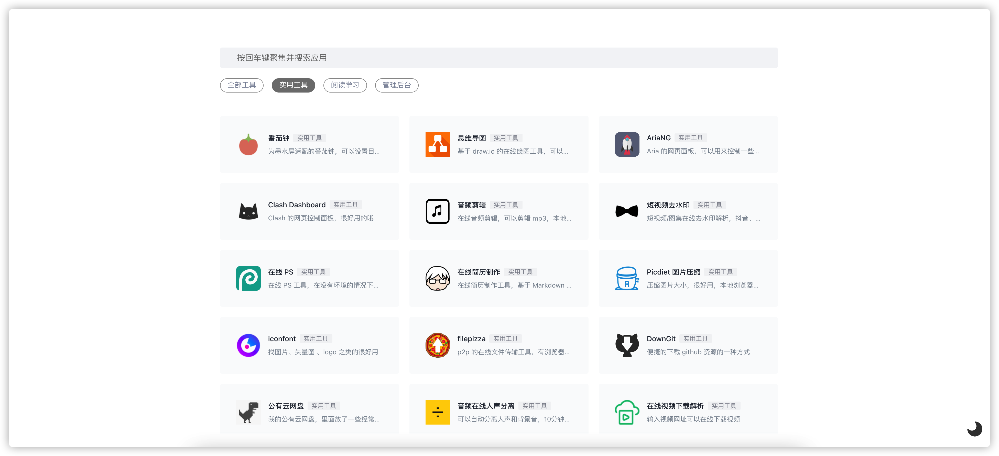
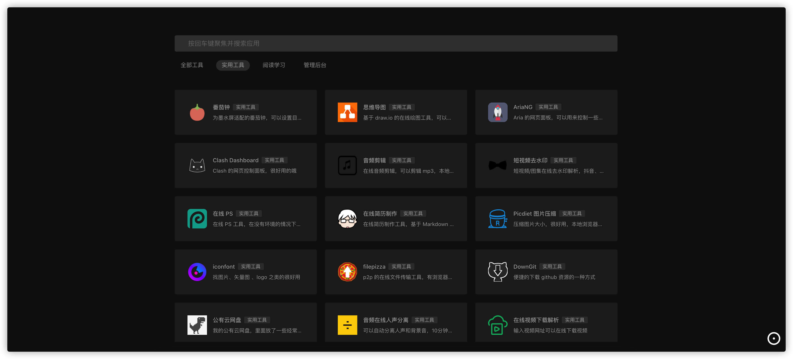
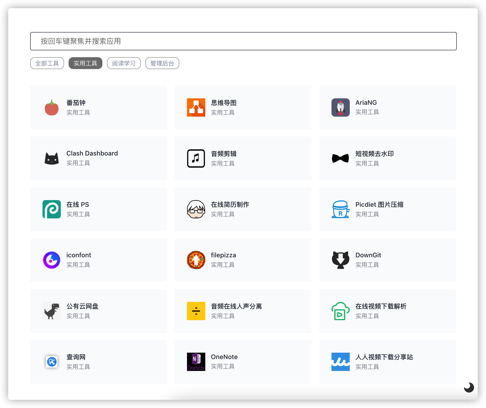
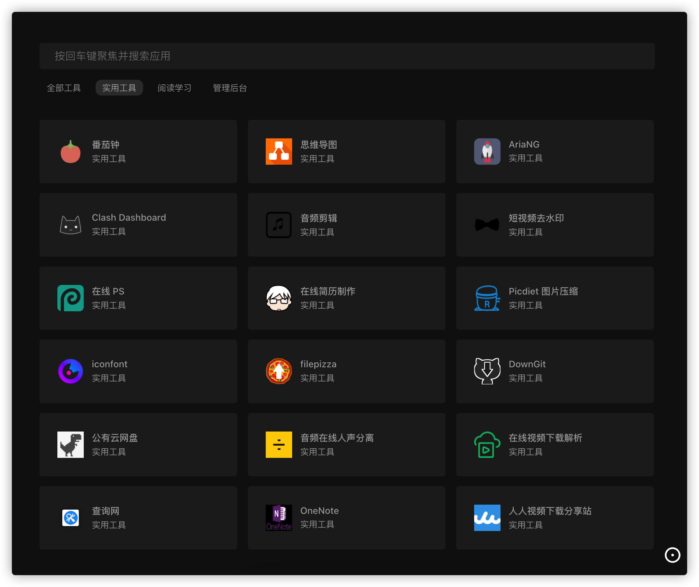
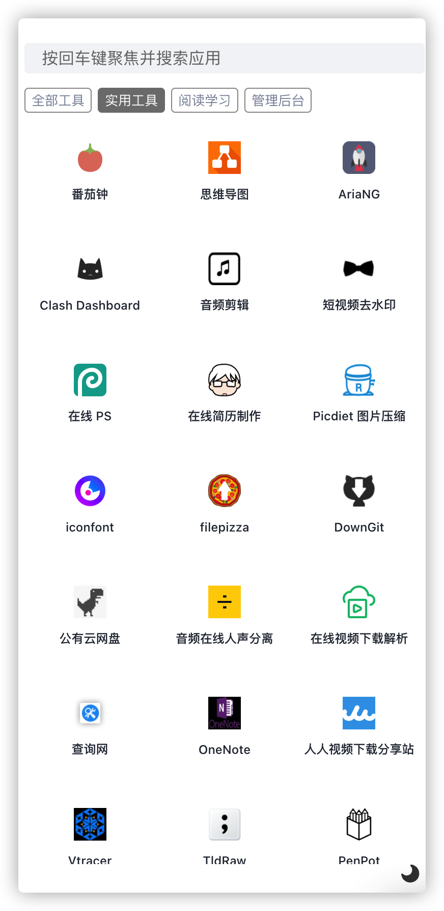
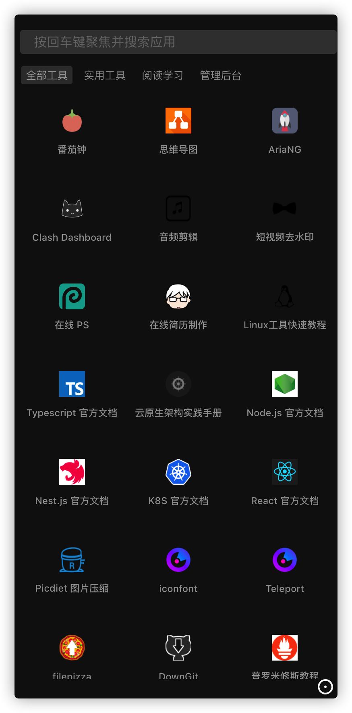
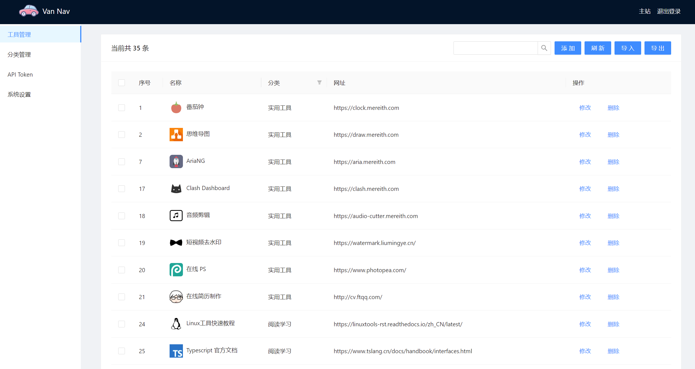

# Van Nav

一个轻量的导航站，现在有搜索引擎集成了，很适合作为主页使用。本项目作为 vannav 的分支版本。

默认用户名和密码：都是 admin。

<div align=center ></div>
<div align=center ></div>
<div align=center ></div>
<div align=center ></div>
<div align=center></div>
<div align=center></div>
<div align=center></div>

## 快捷键

其实这个导航站有很多小设计，合理使用可以提高使用效率：
- 只要在这个页面里，直接输入键盘任何按键，可以直接聚焦到搜索框开始输入。
- 搜索完按回车会直接在新标签页打开第一个结果。
- 搜索完按一下对应卡片右上角的数字按钮 + Ctrl (mac 也可以用 command 键) ，也会直接打开对应结果。

另外可以设置跳转方式哦。

## 安装方法
### Docker

```
docker run -d --name vannav --restart always -p 6412:6412 -v /opt/vannav-hjm:/app/data hanjiaming/vannav:x.x.x-dev
```

打开浏览器 [http://localhost:6412](http://localhost:6412) 即可访问。

- 默认端口 6412
- 默认账号密码 admin admin ，第一次运行后请进入后台修改
- 数据库会自动创建在当前文件夹中： `nav.db`


### 可执行文件

下载 release 文件夹里面对应平台的二进制文件，直接运行即可。

打开浏览器 [http://localhost:6412](http://localhost:6412) 即可访问。

- 默认端口 6412，启动时添加 `-port <port>` 参数可指定运行端口。
- 默认账号密码 admin admin ，第一次运行后请进入后台修改
- 数据库会自动创建在当前文件夹中： `nav.db`

## Docker 构建方法

```shell
docker buildx build -t hanjiaming/vannav:0.0.x-dev --platform linux/amd64 .
```

## 本地调试方法

前端前台

```bash
cd ui/website
yarn i
yarn start
```

前端后台

```
cd ui/admin
yarn i
yarn dev
```

后端

```
cd server
go mod tidy
go run .
```

## API
本导航站支持 API，可以用自己的方法添加工具。

## 状态

可以优化的点太多了，慢慢完善吧……

- [x] 多平台构建流水线
- [x] 定制化 logo 和标题
- [x] 导入导出功能
- [x] 暗色主题切换
- [x] 移动端优化
- [x] 自动获取网站 logo
- [x] 拼音匹配的模糊搜索功能
- [x] 按键直接搜索，搜索后回车直接打开第一项
- [x] 图片存库，避免跨域和加载慢的问题
- [x] gzip 全局压缩
- [x] 中文 url 图片修复
- [x] svg 图片修复
- [x] 浏览器插件
- [x] 自动获取网站题目和描述等信息
- [x] 后台按钮可自定义隐藏
- [x] github 按钮可隐藏
- [x] 支持登录后才能查看的隐藏卡片
- [x] 搜索引擎集成功能
- [x] 增加一些搜索后快捷键直接打开卡片
- [x] 支持自定义跳转方式
- [x] 自动主题切换
- [ ] 国际化
- [x] 增加 ServiceWork ,离线可用,可安装
- [ ] 网站状态检测
- [x] 支持后台设置默认跳转方式
- [x] 支持指定监听端口

